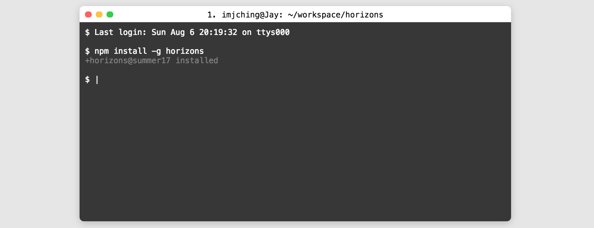

# Frontend Interview Questions

Use Codepen to implement these tasks purely on the client side. Wherever necessary you can use dummy data to fill out the contents.
These exercises are meant to test your ability to write HTML/CSS/JavaScript purely in the Browser. 

Each question has multiple stages. Complete them one at a time. If you get stuck, you can skip to the next question.

Guidelines:

- Don't worry about backend integration.
- You are welcome to Google, but **don't copy paste code.**
- Try to implement these solutions using pure HTML/CSS. Don't use Bootstrap (or similar library).
- You can use jQuery or React.

## Main Questions

### Question 1: (HTML and CSS) Clone this terminal

### Question 2: (HTML, CSS and jQuery) Sticky Header

1. Display a header row at the top of the page.
2. Make header row sticky, that is, it stays visible when you scroll down.
3. Add expandable drop-down menu items to the header.

### Question 3: (React) Implement a Modal Component

1. Implement a React modal component.
1. Create a button that opens the modal when clicked.
1. You can refer to the [react-modal](https://github.com/reactjs/react-modal) node module, but don't copy paste.

### Question 4: (jQuery) Autocomplete Box

How would you make an "autocomplete" input that can filter through given items?

* access the input value
* filter through a list of items
* render these onto the page
* NO refreshing the page! This is a use-case for client-side rendering. You can use jQuery for this.
* (Bonus) load [this list of names](https://raw.githubusercontent.com/dominictarr/random-name/master/first-names.txt) into your autocomplete box

## Bonus

### Question 5: Implement a spreadsheet

1. Display a grid of editable cells that takes up the whole page with no margins
    - Column headers should have letters (A, B, C)
    - Row headers should have numbers (1, 2, 3, 4)
1. Implement insert empty row/column functionality
2. (Bonus) Implement drag-and-drop re-ordering of rows/columns

### Question 6: Sidebar

How would you make a spreadsheet similar to Excel or Google Sheets?

* Must be able to support an arbitrary amount of data - 10 to 10k rows & columns
* Use event bubbling for performance (or react)
* Sorting

1. Sidebar that contains arbitrary items on the left side of the page
1. When collapsed sidebar turns into a button, can be expanded
1. (Bonus) Use media queries to auto-collapse sidebar on mobile
2. (Bonus) Animate collapsing and expanding the sidebar

### Question 7: Realtime Newsfeed

1. Design HTML/CSS for a Facebook like news feed
    - with a profile picture for each item, and the name of the person who posted it
    - A post body containing: an image or text
    - A list of likes
    - A like button?
1. Add ability to post comments on feed items.
1. Add ability to respond to comments in items. If a comment is a response to a previous comment, it should be indented. So if a comment is a response to a response to a response, it should be indented 3 levels.
1. Add the ability to collapse comment threads i.e. hide all comments that are in response to a particular comment.
1. (Bonus) Display more news feed items when the user scrolls.

### Question 8: (React) Countdown Timer

Write a frontend to allow users to set and reset a timer.

1. Show a countdown clock. This clock must run down in real-time.
    - with hour, minutes and seconds
    - a name
    - a start, pause, and reset button
1. Allow the user to input a time for the countdown
1. Add logic to make the start, pause and reset buttons work
1. When a clock has finished, render a notification on the page
1. (Bonus) Add the ability to create and remove timers
  - Allow multiple timers to run simultaneously
1. (Bonus) Use the browser media APIs to play a tone when a timer has completed

### Question 9: (React) Build Tinder

1. Create a card interface
    - A profile picture
    - Name, age, bio
    - Like and unlike buttons
    - the card should be centered on the screen
1. Add logic that will hide the current card and show the next card when the like or unlike button is pressed
1. Allow these cards to be 'swiped' left or right
1. (Bonus) Animate the swiping by making the card rotate slightly and fade away

## Links and resources

1. [http://howtocenterincss.com](http://howtocenterincss.com)
1. [https://github.com/h5bp/Front-end-Developer-Interview-Questions](https://github.com/h5bp/Front-end-Developer-Interview-Questions)
